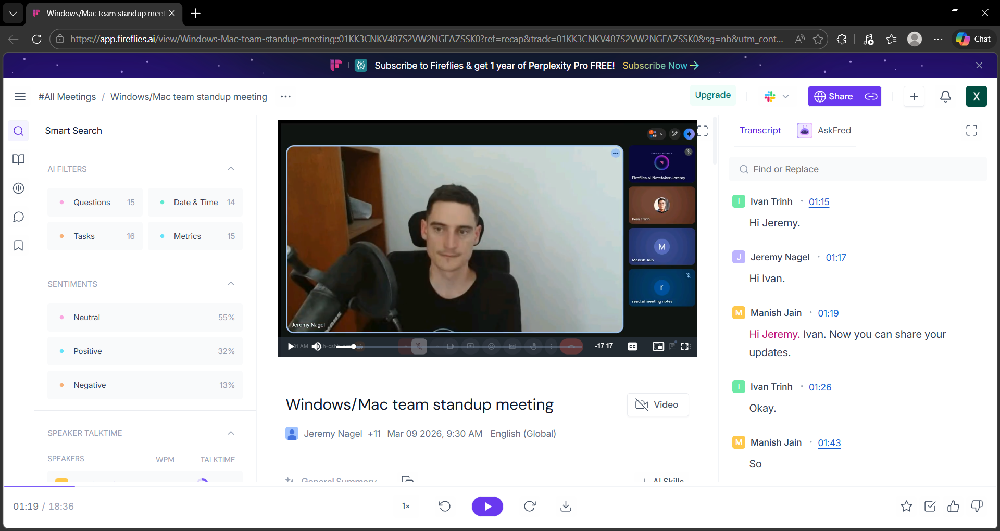

# Agile Ceremonies & Team Collaboration - Khalida Aliyeva

## 🛠️ Practical Task Execution (Asynchronous Participation)

I participate in Agile ceremonies asynchronously by reviewing recordings and AI recaps due to my university schedule and time zone differences.

### 1. Daily Stand-up Observation
- **Date of Meeting:** March 9, 2026
- **Tool:** Fireflies.ai Recap
- **Key Observation:** I watched the recorded stand-up session featuring **Jeremy Nagel** (Product Owner) and the engineering team.
- **Specific Detail:** During the 18-minute session, the team coordinated updates between the Windows and Mac branches. I observed Jeremy arriving and the team (Manish and Ivan) immediately transitioning into sharing their technical updates. This showed me how "alignment" works in real-time to keep the project on track.
- **Evidence:** 

### 2. Retrospective Review
I have reviewed the team's past notes to understand their feedback loop. They focus on identifying technical blockers early to avoid delays in the testing phase.

### 3. Collaboration Improvement
I ensure all my bug reports and task updates are documented on GitHub with clear links to the Kanban board. This allows the team to review my work asynchronously while I am attending classes.
