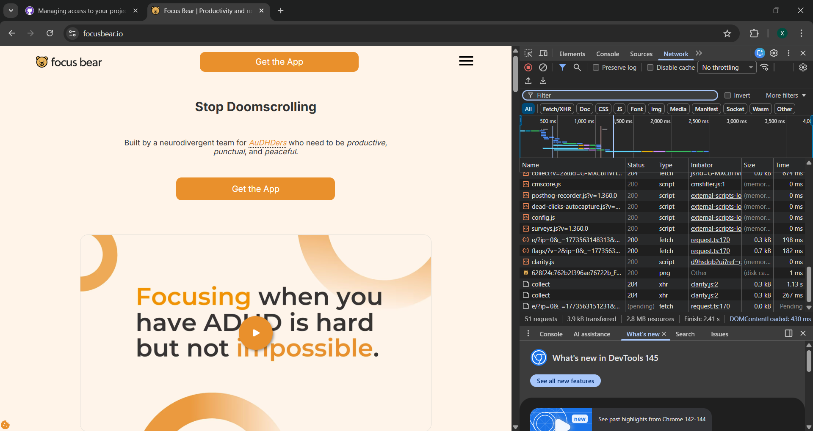
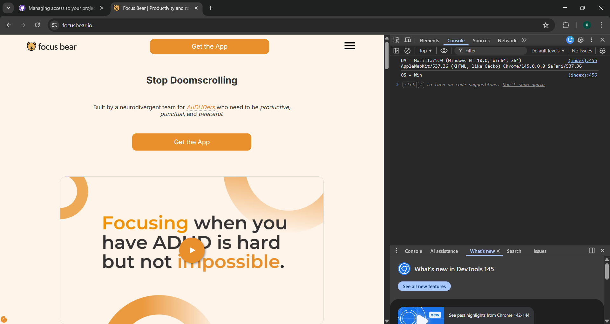

# Debugging Tools Reflection - Khalida Aliyeva

## Practical Evidence of Debugging
I used Browser DevTools to analyze the Focus Bear website.

### 1. Network Analysis
I monitored the Network tab to observe resource loading.

### 2. Console Logging
I checked the Console tab for system logs and environment details.

## Reflection
If Focus Bear crashes on a user’s device, I would use Logcat (Android) or Xcode (iOS) to find the "Fatal Exception" in the logs. When reporting a bug, I include status codes (like 404/500), error messages from the console, and the device environment.
